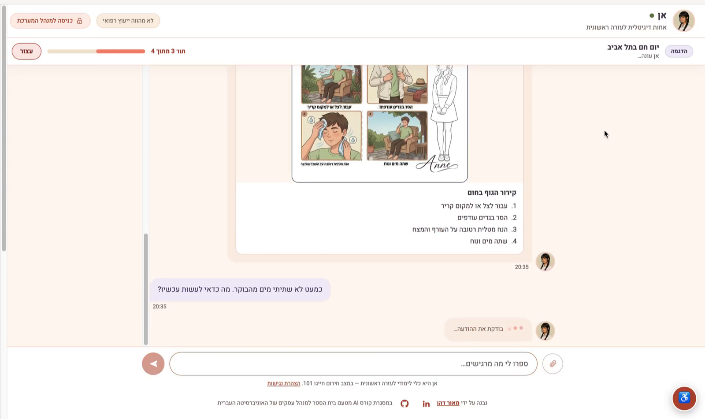
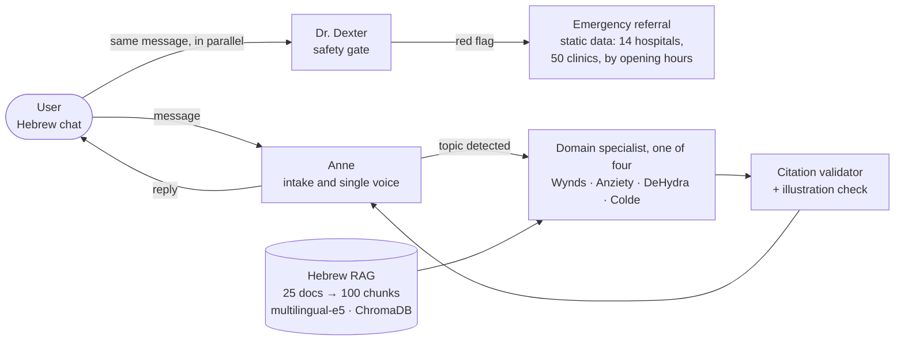
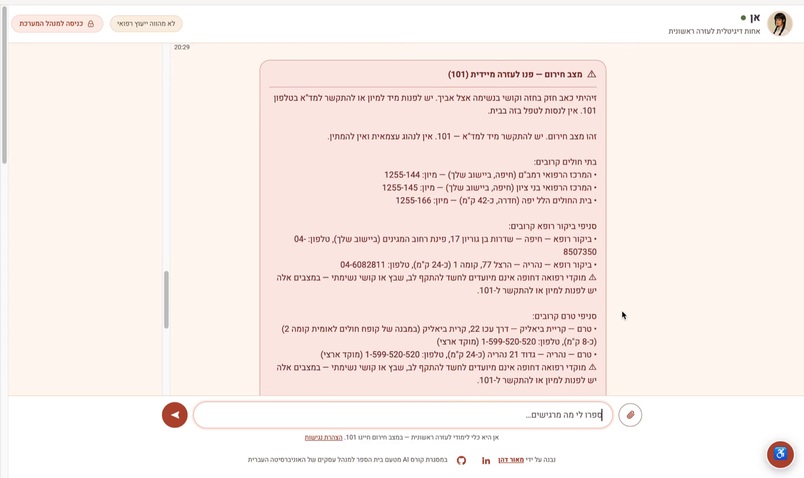
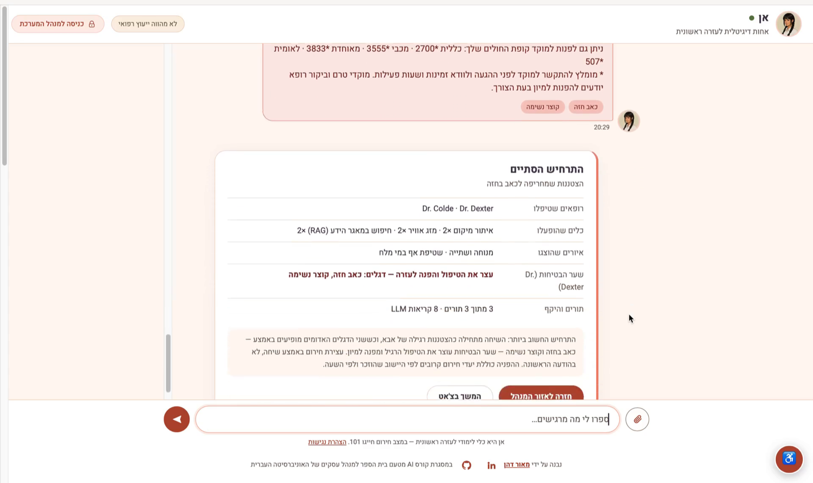
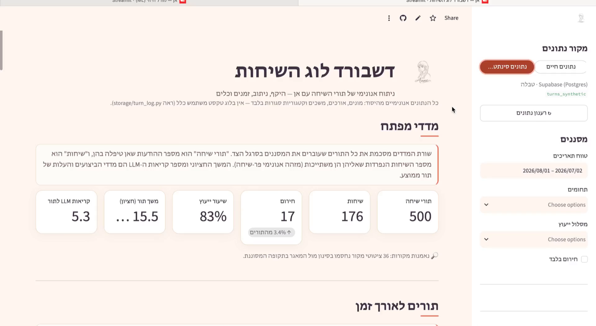
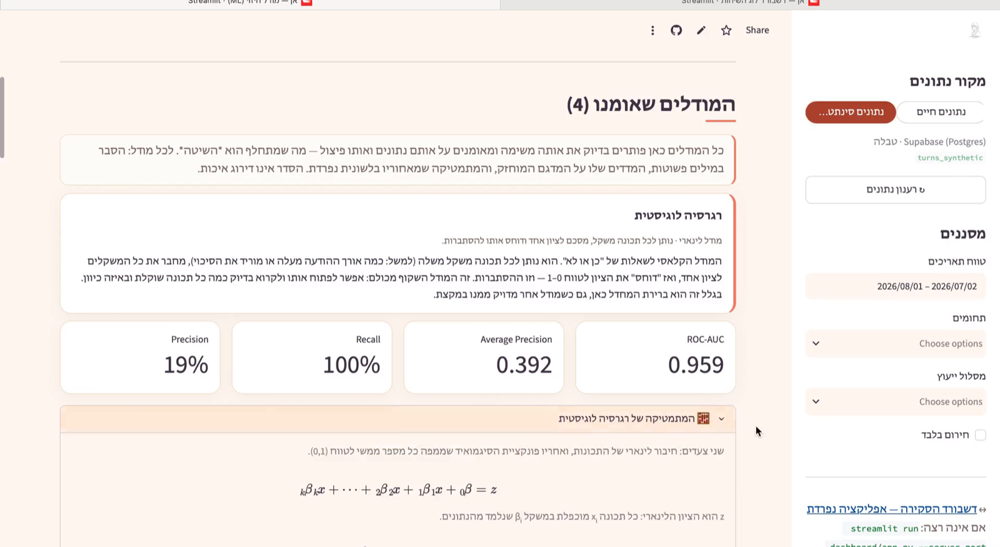

<p align="center">
  
</p>

<h1 align="center">Anne — Hebrew pre-triage medical assistant</h1>

<p align="center">
  Six cooperating agents, a safety gate that can override all of them, and a Hebrew RAG pipeline —<br>
  built to keep people who can be treated at home out of the ER, and to send the others there fast.
</p>

<p align="center">
  
  
  
  
</p>

<p align="center">
  <a href="#quickstart">Quickstart</a> · <a href="#how-it-works">How it works</a> · <a href="#screenshots">Screenshots</a> · <a href="docs/ARCHITECTURE.en.md">Full documentation (EN)</a> · <a href="docs/ARCHITECTURE.he.md">תיעוד מלא (עברית)</a>
</p>



> Final project of the Hebrew University AI Developer program (School of Business Administration, 2026).
> Educational project — Anne gives first-aid guidance only and is not a substitute for medical advice.

## What it does

- **Interviews the patient in Hebrew** — a short, focused intake (anamnesis), one question at a time.
- **Gives source-grounded home-care guidance** for four mild conditions — cuts and wounds, anxiety, dehydration, common cold — with a step-by-step illustration.
- **Escalates when it must.** A safety agent screens every turn in parallel; red flags stop the team and return the nearest open ER and urgent-care clinics for the user's location and hour.
- **Never invents a source.** Citations are validated in code against the knowledge base; anything not in the corpus is dropped.
- **Ships with the ops around it** — anonymous privacy-by-design turn log, analytics dashboard, ML escalation models, admin area, WCAG 2.1 AA accessibility, 127 automated tests.

In Israel, ~49% of ER visits that end in discharge are classified as potentially non-urgent. Anne is an attempt at the pre-triage layer that could catch some of them.

## How it works



- **One voice, a whole team.** The user only ever hears Anne. Four domain specialists and a routing manager work behind her; the safety agent (strongest model, temperature 0.1) runs in parallel with the intake and its verdict always wins.
- **Direct path when the topic is clear** — one structured LLM call per step, RAG chunks injected in code, no tool loops. Hierarchical routing only when the topic is ambiguous. Four LLM calls per turn on the direct path.
- **Deterministic where it matters.** Emergency destinations, citations, illustration IDs and the red-flag safety net (`crew/red_flags.py` — "chest pressure" is a red flag, "work pressure" is not) are code, not model output.
- **Context without asking.** Time, weekday and — when a town is mentioned — the weather are injected into every prompt from free, keyless tools.

## Screenshots

| | |
|---|---|
|  <br> **Emergency referral** — the safety agent stops the intake and lists the nearest open ER and urgent-care clinics |  <br> **Scenario summary** — which specialists handled the case, tools used, red flags, LLM calls |
|  <br> **Analytics dashboard** — Streamlit over the anonymous turn log |  <br> **ER-escalation models** — four scikit-learn models vs. a 0.50 baseline (synthetic data) |

## Quickstart

```bash
git clone https://github.com/maordahan25/anne-triage-assistant.git
cd anne-triage-assistant
python -m venv .venv && source .venv/bin/activate      # Windows: .venv\Scripts\activate
python -m pip install --prefer-binary -r llm_requirements.txt

cp .env.example .env                 # add OPENAI_API_KEY (+ ADMIN_EMAIL / ADMIN_PASSWORD for the admin area)
python build_index.py                # builds the vector DB; first run downloads the ~2 GB embedding model
python test_anne_suite.py --offline  # free sanity check, no LLM calls

python -m uvicorn server.app:app --port 8000   # then open http://localhost:8000
```

Talking to Anne costs LLM calls; everything else (dashboards, ML, tests) runs free and offline:

```bash
streamlit run dashboard/app.py --server.port 8501      # analytics dashboard
streamlit run dashboard/ml_app.py --server.port 8502   # prediction models
python -m storage.synthetic --rows 500 --seed 42       # synthetic log for the dashboards
```

## Stack

Python 3.12 · CrewAI · OpenAI API (Anthropic switchable) · ChromaDB + `multilingual-e5-large` · Pydantic · FastAPI + SSE · vanilla HTML/JS (RTL) · Streamlit · pandas · scikit-learn · SQLite / Supabase (Postgres, RLS) · Pillow + numpy (vision layer)

## Safety and privacy

- The safety agent's verdict overrides every other agent; a technical failure never silences it (fixed fallback referral in code).
- The turn log has **no free-text column** — messages are stored as lengths, sources as counts; a per-column validator and SQL CHECK constraints enforce it.
- Uploaded images are stripped of EXIF, analyzed in memory and never stored; the log records a single `image_attached` flag.
- Admin actions (log reset, model training) are locked by default and never rendered in cloud deployments.

## Tests

`python test_anne_suite.py --offline` — offline suite (RAG, agents' contracts, log schema and scrubbing, dashboards via AppTest, ML, accessibility, admin auth).
`python test_anne_suite.py` — 10 live end-to-end scenarios (paid LLM calls).

## What I learned

- A single-word red-flag rule ("pressure") stopped anxiety conversations for no reason; the fix was contextual detection in code plus a safety net that can only tighten, never loosen.
- In CrewAI 1.6 every structured step cost two LLM calls; injecting the schema into the prompt and parsing in code removed the duplicate, with an automatic fallback to the old path.
- Chunking by section headers made every chunk a self-contained unit of meaning, and a code-level citation filter guarantees an invented source never reaches the user.

## Status

Working end to end; demoed live. Next: latency on the hierarchical path, calibration of the prediction models on real data, RAGAS-style quality checks. See [docs/ARCHITECTURE.he.md](docs/ARCHITECTURE.he.md) for every design decision, in Hebrew.

## Credits

Built by [Maor Dahan](https://www.linkedin.com/in/maordahan) as the final project of the Hebrew University AI Developer program. Knowledge base rewritten from public medical sources (HMOs, MDA); illustrations generated for this project. MIT license.

---

<div dir="rtl">

## אן — בעברית

אן היא עוזרת טרום-מיון בעברית: מנהלת תשאול קצר, נותנת הנחיות טיפול ביתי מבוססות-מקור לארבעה מצבים קלים (פצעים, חרדה, התייבשות, הצטננות), ומפנה למיון או למוקד רפואה דחופה כשמופיע דגל אדום. מאחוריה צוות של שישה סוכנים (CrewAI), סוכן בטיחות בעל סמכות-על, ו-RAG בעברית. פרויקט גמר בקורס AI Developer של האוניברסיטה העברית, 2026 — פרויקט לימודי, לא תחליף לייעוץ רפואי.

התיעוד המלא בעברית — כל החלטת תכנון, הסכמה, הפריסה והבדיקות — ב-[docs/ARCHITECTURE.he.md](docs/ARCHITECTURE.he.md).

</div>
